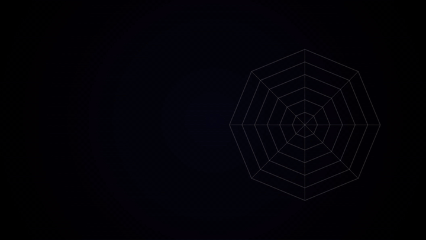

# Radar-Renderer

**[⚡Instant Start, Deployed Service](https://radar.xn--30q18ry71c.com/)**

[](https://github.com/LeeShunEE/Radar-Renderer/actions/workflows/ci.yml)
[](./LICENSE)
[](./CONTRIBUTING.md)

> **English** · [简体中文](./README.zh-CN.md)

A tool for rendering **animated radar charts as video**, built for side-by-side
comparison of multiple models/subjects. The frontend is a Next.js + Remotion app;
the backend is a FastAPI service (under development).

<p align="center">
  
</p>

<p align="center">
  <a href="https://www.bilibili.com/video/BV1zuLK6sE4a">View Full Video</a>
</p>

## Features

- 🎬 **Video-first radar charts** — radar visualizations rendered as video via Remotion.
- 🆚 **Multi-model comparison** — overlay and compare several subjects on one panel.
- 🧩 **Composable frontend** — Next.js 16 + React 19 + Remotion player & renderer.
- ⚙️ **API backend** — FastAPI service for auth, storage, and server-side rendering (WIP).
- ✅ **Tested by design** — three-tier test system (unit / dev-integration / testenv-integration) with coverage gates.

## Tech stack

| Layer | Stack |
| - | - |
| Frontend | Next.js 16, React 19, Remotion 4, Tailwind CSS 4, Zod |
| Backend | FastAPI, Uvicorn, Python 3.11+ (managed with `uv`) |
| Tooling | pnpm (frontend), uv (backend), Vitest, Pytest, Playwright, Ruff, ESLint |

## Quick start

Bring up the full stack (frontend + backend + render worker + PostgreSQL) with
Docker Compose — configure once, then deploy with a single command.

### Prerequisites

- Docker + Docker Compose v2

### 1. Configure

```bash
cp deploy/.env.example deploy/.env
```

Edit `deploy/.env` and set at least the required secrets:

- `POSTGRES_PASSWORD` — database password
- `JWT_SECRET_STRING` — random string, ≥ 32 chars
- `RENDER_CALLBACK_TOKEN` — random string, ≥ 32 chars

### 2. Deploy

```bash
cd deploy
docker compose up -d --build
```

For production reverse-proxy / Coolify setup, port exposure, the full variable
reference, and troubleshooting, see [`deploy/README.md`](./deploy/README.md).

## Repository layout

- `frontend/` — Next.js + Remotion app
- `backend/` — FastAPI service (under development)
- `tests/` — unified three-tier test tree (`unit/`, `dev-integration/`, `testenv-integration/`)
- `scripts/` — tooling & git-hook mirrors
- `deploy/` — container/compose deployment
- `docs/` — design notes, audits, and plans

## Testing

```bash
# Backend (unit + dev-integration)
cd backend && uv run pytest ../tests/unit/backend/ ../tests/dev-integration/backend/ -v

# Frontend
cd frontend && pnpm test:unit && pnpm test:integration
```

The full conventions (test layering, naming rules, coverage thresholds, commit
format) live in [`CLAUDE.md`](./CLAUDE.md) and are distilled for humans in
[`CONTRIBUTING.md`](./CONTRIBUTING.md).

## Assets

Resource files under `frontend/public/silhouettes/` and `frontend/public/music/`
are **not** committed. Add your own assets to those directories locally.

## Contributing

Contributions are welcome! Please read [`CONTRIBUTING.md`](./CONTRIBUTING.md)
first — note that all commits must be **signed off** (DCO, `git commit -s`).
By participating, you agree to abide by the [`Code of Conduct`](./CODE_OF_CONDUCT.md).

Opening an issue? Use the templates under
[`.github/ISSUE_TEMPLATE/`](./.github/ISSUE_TEMPLATE/) —
[🐛 Bug report](./.github/ISSUE_TEMPLATE/bug_report.yml) or
[✨ Feature request](./.github/ISSUE_TEMPLATE/feature_request.yml).

## License

This project is licensed under the **GNU General Public License v3.0** —
see [`LICENSE`](./LICENSE).

> ⚠️ **Third-party notice — Remotion.** The frontend depends on
> [Remotion](https://www.remotion.dev/), which ships under its **own license**
> (source-available; free for individuals and small companies, larger companies
> require a paid company license). Remotion is **not** OSI open source and is
> **separate** from this project's GPL-3.0 grant. When you use or build this
> project you must independently comply with Remotion's license. See
> [`NOTICE`](./NOTICE) and https://www.remotion.dev/license.
